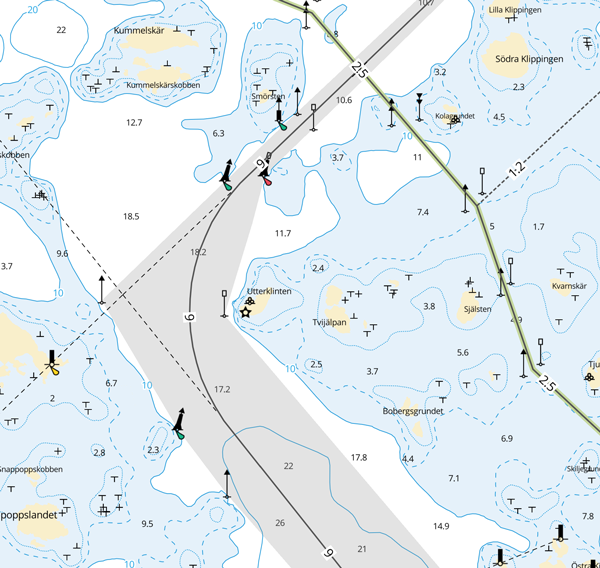

# Vectorized Finnish Nautical Charts - Merikartat



Generate Finnish nautical charts in [Mapbox vector tile](https://docs.mapbox.com/vector-tiles/reference/) format or rasterize your custom PNG tiles. 

*Scripts and chart styles are very much in progress and the charts produced are missing relevant information!**

* [Hydrographic data (Finnish Transport Agency)](https://vayla.fi/avoindata/kehittajille)
```
Lähde: Liikennevirasto. Ei navigointikäyttöön. Ei täytä virallisen merikartan vaatimuksia.
Contains information received from the Finnish Transport Agency’s nautical chart database 04/2020
```

* [Topographic data (Maanmittauslaitos)](https://www.maanmittauslaitos.fi/kartat-ja-paikkatieto/asiantuntevalle-kayttajalle/kartta-ja-paikkatietojen-rajapintapalvelut-3)

```
Contains data from the National Land Survey of Finland Topographic Database 04/2020
```

## Install dependencies

* Install Docker
* Install PostGIS
* Run `npm install`

## Get the data

#### Create PostGIS database `merikartta`

*TODO: Use PostgreSQL in Docker?*

With `psql -U postgres`:

```
CREATE DATABASE merikartta;
\c merikartta
CREATE EXTENSION postgis;
CREATE EXTENSION postgis_raster;
CREATE EXTENSION postgis_topology;
CREATE EXTENSION fuzzystrmatch;
CREATE EXTENSION postgis_tiger_geocoder;
```


#### Fetch Väylä data (CSV) 

Run `import/fetch-csv-from-vayla.sh`

Data set is quite big, nearly 1.5 GB.

#### Convert Väylä data into GeoJSON

Run `node --max-old-space-size=8192 import/convert-csv-to-geojson.js`

This can take an hour to run, the script is highly unoptimized for large datasets such as `syvyysalue.csv` and `syvyyskayra.csv`.

#### Fetch Maanmittauslaitos data (GeoJSON)

Run `import/fetch-geojson-from-mml.js`

#### Calculate `taululinja` overlaps

Run `import/calculate-taululinja-overlap.js`

#### Prepare GeoJSON data for import

Run `import/prepare-geojson-data.sh`

This will take some time, especially the first step when generating `syvyysalueet-dissolved-white.geojson` file. Running the [Mapshaper](https://github.com/mbloch/mapshaper) commands in parallel will speed up the process.

#### Import GeoJSON data into PostGIS

Run `import/import-data-to-psql.js`


## Start the tile server

Build and watch preview client files using [Parcel](https://parceljs.org/): 

`npm run watch-client`

Start the tile and preview server: 

`npm run start`

Open http://localhost:3000/

## Generate vector MBTiles

TODO

## Generate raster MBTiles

TODO

## Generate client styles and assets

TODO

## Development 

### Data documentation

[Merikartta-aineistojen tietosisällön kuvaus](https://vayla.fi/documents/20473/38174/Merikartta-aineistojen_tietosis%C3%A4ll%C3%B6n_kuvaus.pdf/78afa9e5-8f7c-4430-b798-f9848c79123f)

[Vesiväyläaineistojen tietosisällön kuvaus](https://vayla.fi/documents/20473/38174/Vesiv%C3%A4yl%C3%A4aineistojen+tietosis%C3%A4ll%C3%B6n+kuvaus/68b5f496-19a3-4b3d-887c-971e3366f01e)

[Maanmittauslaitoksen maastotietokohteet](https://www.maanmittauslaitos.fi/sites/maanmittauslaitos.fi/files/attachments/2018/03/Maastotietokohteet_0.pdf)

[Maanmittauslaitoksen maastokartta-aineiston koodit](https://www.maanmittauslaitos.fi/sites/maanmittauslaitos.fi/files/attachments/2018/05/MARA-MATI_Karttatiimi_Maastokartta_100000_koodit.pdf)

### Map styles

* Edit [Mapbox style](https://docs.mapbox.com/mapbox-gl-js/style-spec/) json: TODO
* Edit fonts / glyphs: TODO
* Edit SVG-sprites: TODO
* Edit OpenLayers conversion


## License

MIT

**Please note that the nautical and topographical data sources are not part of this repository and have their own licenses.**
